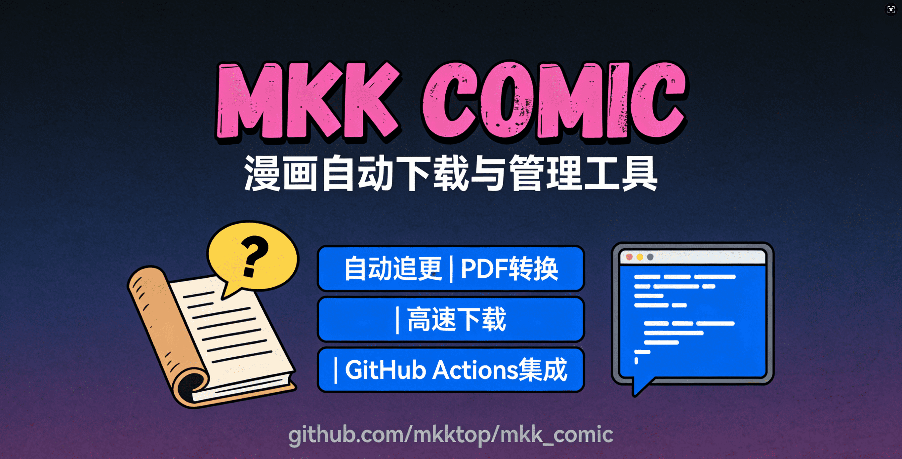
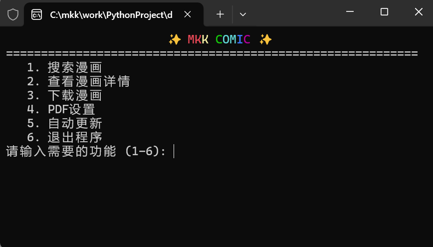
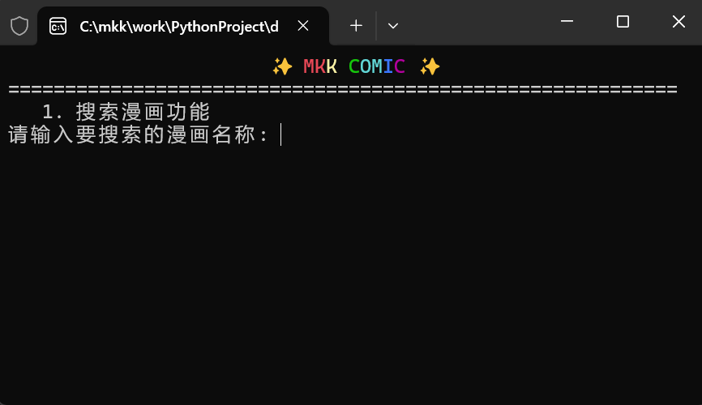
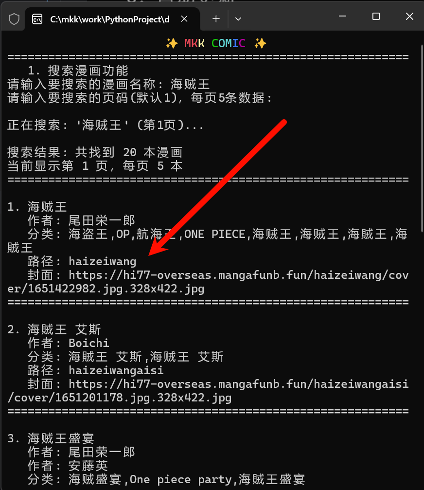
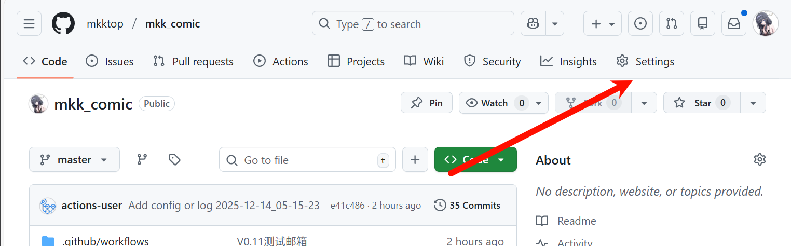
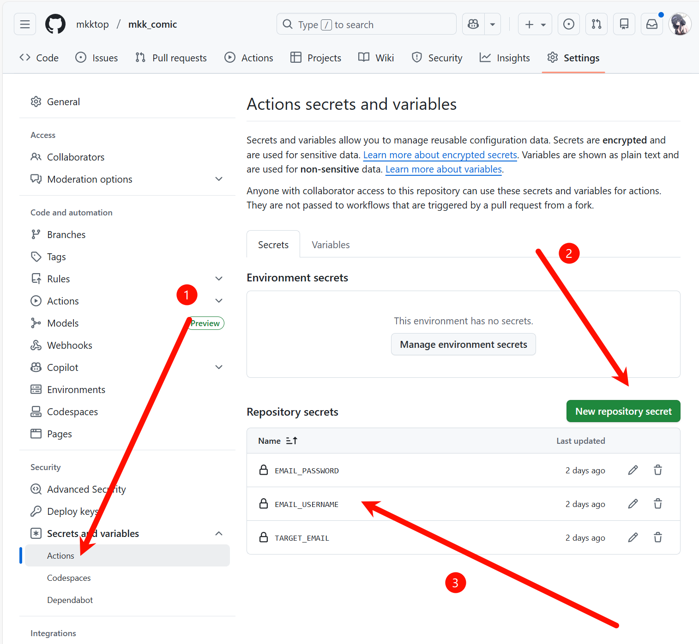
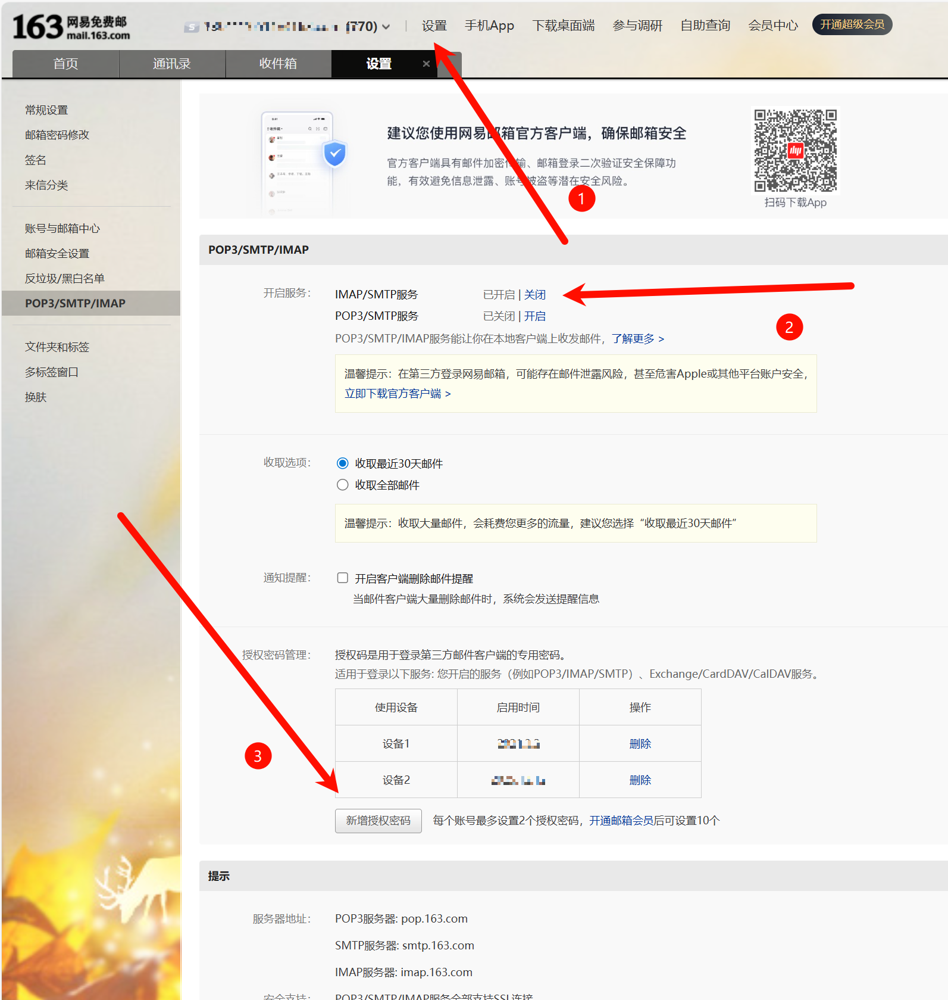

<div align="center">
    <p><em>📚 漫画自动下载与管理工具，支持自动追更、PDF转换与加密，无需科学上网即可高速下载</em></p>
<a href="https://github.com/mkktop/mkk_comic"></a>
    <div>
        <a href="https://github.com/mkktop/mkk_comic/blob/main/LICENSE">
        
        </a>
        <a href="https://github.com/mkktop/mkk_comic/releases">
        
        </a>
        <a href="https://github.com/mkktop/mkk_comic/releases">
        
        </a>
        <a href="https://github.com/mkktop/mkk_comic/issues">
        
        </a>
        <a href="https://github.com/mkktop/mkk_comic/stargazers">
        
        </a>
        <a href="https://github.com/mkktop/mkk_comic/network/members">
        
        </a>
    </div>
</div>

# mkk_comic 漫画自动下载工具

## 项目简介
这是一个漫画下载和管理工具，依托github action可实现漫画定时自动下载，并通过邮箱进行推送，同时也可将漫画转换成PDF形式，支持密码设置

## 核心功能

- **自动下载**：通过github Actions 实现自动下载，自动追更
- **急速下载**：不需要科学上网，下载速度极快
- **PDF转换**：将下载的图片自动转换为PDF文件，支持加密保护
- **配置管理**：记录漫画的最后阅读章节和检查时间，便于跟踪更新
- **邮箱推送**：漫画下载完毕，可自动推送到邮箱
- **定时任务**：可自定义执行时间，可限制漫画一次推送数量
- 
## 使用方式
需要先将该工程fork到自己的名下，如何fork工程请自行百度
### 1.获取漫画的订阅地址
以下方式二选一即可
<details>
    <summary>通过拷贝网站获取</summary>

### 通过浏览器进入网站
拷贝网址:https://www.2025copy.com  
选择想要追更的漫画，复制浏览器上的链接地址如:haizeiwang
  
</details>

<details>
    <summary>通过运行打包文件或者该python脚本</summary>

### 获取打包文件(直接运行脚本效果相同)
进入[Release页面](https://github.com/mkktop/mkk_comic/releases)下载发布的exe打包文件  
将该文件放入没有中文的目录(中文目录不兼容)双击运行
  
输入1回车  
  
输入你想要搜索的漫画，如海贼王
  
复制保存该订阅路径
</details>

### 2.配置自动下载参数
进入项目的config文件夹的comic.yaml进行配置  
严格按照下方的注释填写配置:
```
global:
  pdf_switch: 0 #是否生成PDF(1为生成，0为不生成)
  pdf_password: None #PDF密码(None为不设置密码)
  
comics: #漫画列表，多个漫画请填写多个
- name: 海贼王 #名称自定义
  path: haizeiwang #漫画订阅地址，按照第一点进行获取
  last_chapter: 373 #订阅起始的章节
  download_limit: 2 #每次最多下载多少章
  last_check_time: '2025-12-11 05:49:12' #上一次脚本执行时间(第一次配置可随意填写)
```

### 3.配置推送邮箱(可选)
进入设置界面
 
   
按照图中操作创建三个密钥
```
EMAIL_USERNAME  #你用来推送漫画的邮箱，目前仅支持163邮箱
EMAIL_PASSWORD  #授权密码(下方有获取授权密码教程)
TARGET_EMAIL    #用于接收推送的邮箱可以和发送邮箱保持一致
```
<details>
    <summary>获取邮箱授权密码</summary>

### 进入163网易邮箱网页版
- 选择设置
- 开启SMTP服务
- 新增授权密码


</details>

### 4.修改下载/推送时间(可选)
- 进入项目路径 .github/workflows 文件夹
- 修改run-python.yml文件
- 修改第5行代码(默认每天北京时间9点半)
- 修改方式请自行询问AI
```
  schedule:
    - cron: '30 1 * * *'  # 北京时间每天上午9点30分运行（UTC+8 → 1+8=9:30）
```

### 5.执行任务
- 设置好后会自动定时执行
- 修改代码进行提交后也会执行一遍
- 也可手动进行执行
  
点击绿色图标New Workflow

### 获取下载后的漫画文件
45MB以内的文件会同时推送到邮箱，大文件可通过下方方式下载(文件保留90天)
- 在Action页面点击执行完的工作流

- 在页面底部点击下载


## 本地使用
可以进入[Release页面](https://github.com/mkktop/mkk_comic/releases)下载发布的exe打包文件，也可以克隆代码本地执行。  
本地功能如下图所示，如需要自动下载，第一次自动更新后，会在当前目录生成配置文件，请按照前面步骤填写。
  

## 免责声明

- 本工具仅作学习、研究、交流使用，使用本工具的用户应自行承担风险
- 作者不对使用本工具导致的任何损失、法律纠纷或其他后果负责
- 作者不对用户使用本工具的行为负责，包括但不限于用户违反法律或任何第三方权益的行为

## 其他

任何使用中遇到的问题、任何希望添加的功能，都欢迎提交issue或开discussion交流，我会尽力解决  